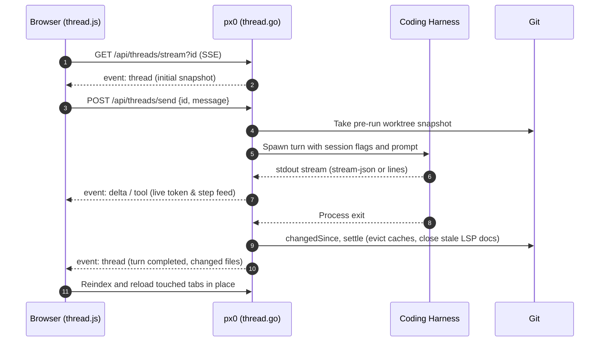

# Architecture & Systems Internals

px0 achieves sub-millisecond startup, instantaneous file navigation, ~20 MB resident memory consumption, multi-turn coding agent threads, and real-time Git/GitHub collaboration through dedicated systems engineering principles. This document provides a technical walkthrough of its internal architecture.

## High-Level Subsystem Flow

```text
Browser Client (Vanilla JS + CSS)
  ├── DOM Virtualized Row Engine (~60 mounted DOM rows · 24 row overscan)
  ├── Classic Text & Diff Selection Manager (Offscreen sub-pixel font measurement)
  ├── Bidirectional Scroll Markdown Viewer (goldmark GFM preview)
  ├── Right Inspector & Threads Pane (thread.js, SSE)
  ├── Agent Edit & Batch Comment Composer (linecomment.js, agent.js)
  ├── Chroma Syntax-Highlighted Diff Renderer (diff.js)
  ├── Tab Lifecycle & Batch Dismissal Menu (tabs.js, bus.js)
  ├── File Tree & Context Action Menu (tree.js)
  ├── Keyboard Palette & Command Router (prefix routing: >, @, :)
  ├── PR Review Header Bar & Line Comment Composer (pr.js)
  ├── Sidebar Git Panel & Per-File Stage Controls (gitpanel.js)
  └── Reactive Git Stream Client (gitstream.js, SSE)
            │
            ▼ HTTP / JSON / SSE (Pooled Gzip on 127.0.0.1:7777)
Go Server Runtime (Single Static Binary)
  ├── Subsystem Router (HTTP · JSON · Pooled Gzip)
  ├── Parallel Index Engine (Listen first · Bounded concurrency: NumCPU * 4)
  ├── Classification .gitignore Parser (Segment · Suffix · Path · Regex last)
  ├── Bounded Two-Pass Fuzzy Matcher (O(n) linear backward scan + weight matrix)
  ├── Parallel Grep Engine (Worker buffer reuse · bytes.Contains fast reject)
  ├── Windowed Syntax Lexer (1,000-line hlChunk · 400-line hlContext · 512 MB LRU)
  ├── Server-Side Chroma Diff Tokenizer (highlight.go)
  ├── Multi-Turn Thread Store & Runner (thread.go, SSE /api/threads/stream)
  ├── Native Agent Harness Parsers: claude, agy, gemini, cursor-agent (agent.go)
  ├── Stdio JSON-RPC Language Server (LSP) Client (Lazy spawn · regex fallback)
  ├── Pure Shell-Out Git Controller (git.go, gitpanel endpoints)
  ├── Git Forge Provider Engine (provider.go, github.go, pr.go)
  ├── Reactive Git Watcher (git_watcher.go, SSE /api/stream)
  └── Active Memory Scavenger (debug.FreeOSMemory after 15s)
```

## Subsystem Matrix & Process Model

px0 runs as a single Go binary that owns indexing, search, syntax highlighting, Git operations, and language server dispatch, serving a zero-dependency ES module frontend.

### Subsystem Engines

| Subsystem | Core Mechanism | Operational Role & Guarantees |
| :--- | :--- | :--- |
| **Router** | HTTP · JSON · pooled gzip | Lightweight JSON and SSE transport on `127.0.0.1:7777` with gzip buffer pooling. |
| **Git & GitHub Forge** | Pure CLI shell-out · `os.MkdirTemp` | PR review, merge-base diffs, working-tree staging, commits, and review submission. |
| **Index & Tree** | Parallel tree walk · classification matcher | In-memory tree walk, `.gitignore` parsing, working tree status, and diff discovery. |
| **Search** | Parallel worker pool · `bytes.Contains` | Multi-core full-workspace grep with worker buffer reuse and fast candidate rejection. |
| **Highlight & Markdown** | Chroma LRU + Goldmark GFM | Windowed syntax chunking, server-rendered diff tokens, and bidirectional preview. |
| **LSP Manager** | Lazy spawn · stdio JSON-RPC | On-demand language server client (e.g. `gopls`, `clangd`) with regex fallback. |
| **Agent Dispatch** | Harness runner · diff snapshots | Local harness invocation, overlap guards, and filesystem snapshots. |

### Process Topology & Resource Isolation

```text
┌─────────────────────────────────┐
│ Browser Client (Vanilla JS)     │  ~80-150 MB Tab RSS
│ · ~60 Virtual rows (24 overscan)│  · Zero framework runtime
│ · Offscreen font measurement    │  · rAF-throttled DOM paint
│ · In-memory tree & fuzzy cache  │
└────────────────┬────────────────┘
                 │ HTTP / JSON / SSE (Pooled gzip)
                 │ 127.0.0.1:7777
┌────────────────┴────────────────┐
│ px0 Daemon (Single Go Process)  │  ~20-30 MB Host RSS
│ · Router, Indexer, Search Pool  │  · Pure Go (No CGO, No Node)
│ · Chroma Highlighting, Git Forge│  · Active idle scavenger (15s)
└────────────────┬────────────────┘
                 │ stdio JSON-RPC (Lazy spawn on first use)
┌────────────────┴────────────────┐
│ Host Environment                │
│ · Source Tree + .gitignore      │  · Allowlisted module cache
│ · gopls / clangd / rust-analyzer│  · Process-scoped worktrees
└─────────────────────────────────┘
```

## Core Architectural Tenets

### 1. Optimized for Reads & Delegated Agent Dispatch
px0 does not attempt to be a heavy code editor with character-by-character typing or save buttons. Code authoring is delegated to external AI coding tools (Claude Code, Google Antigravity, Gemini CLI, Cursor Agent, OpenCode, Codex, Aider, Goose) or dedicated terminal editors. px0 focuses entirely on the reader experience, automatically reloading whatever files the harness changed.

### 2. Single Static Binary Distribution
The entire web application (HTML, CSS tokens, JavaScript modules, fonts, icons) is embedded directly into the Go binary at compile time using `go:embed`. px0 requires:
- Zero external dependencies
- No Node.js runtime
- No CGO (100% pure Go)
- No local database engine

### 3. File Tree Indexing, Ignore Engine & Startup Sequencing
When px0 boots, it optimizes for perceived startup time and traversal throughput:
- **Startup Sequencing (Listen First, Index in Background)**: px0 binds the HTTP port and starts listening immediately before traversing the directory tree. The browser opens and renders the UI shell in under 1 ms, while file tree indexing proceeds concurrently in the background.
- **Concurrency**: Traversals run with worker pools bounded to `runtime.NumCPU() * 4` via a walk semaphore.
- **Ignore Classification Precedence**: Rather than spawning recursive git processes, px0 parses `.gitignore` rules in-memory using an optimized classification matcher. Rules are evaluated in strict hierarchical precedence:
  1. `segment`: Direct folder and file name matches (e.g. `node_modules`, `.git`).
  2. `suffix`: Extension and trailing wildcard matches (e.g. `*.log`, `*.o`).
  3. `path`: Anchored directory path patterns (e.g. `dist/bundle/`).
  4. `regex`: Complex wildcard patterns evaluated last to minimize regex compilation overhead.
- **Symlink Cycle Immunity**: Traversal skips directory symlinks entirely, eliminating cyclic loops and preventing runaway traversal across symlinked filesystem hierarchies.
- **Bounded Batch Expansion**: The explorer sidebar header features Expand All and Collapse All controls. Expand All traverses directories in bounded batches (requesting at most four directories concurrently) and skips ignored folders (like `node_modules` or `target`) to avoid bulk-loading massive generated trees. Any user click, file reveal, or tree switch cleanly cancels pending batch expansions, and expanded paths are saved to the server session.

### 4. Reverse Proxy & Subpath Hosting (`-base-path`)
When hosted behind reverse proxies (Nginx, Traefik, Caddy) or multi-tenant review platforms, px0 supports custom URL prefixes via the `-base-path` CLI flag or `server.basePath` in settings (e.g. `/rev-123/`):
- All HTTP endpoints and static routes are prefixed (`/<base-path>/api/...`, `/<base-path>/static/...`).
- `handleIndex` dynamically injects `<base href="/<base-path>/">` into `web/index.html`, allowing the frontend to resolve relative assets and API endpoints without domain-level assumptions.
- Requests to `/<base-path>` without a trailing slash redirect to `/<base-path>/`, and root `/` redirects to the configured base path.

### 5. Bounded Two-Pass Fuzzy Search (`fuzzyScore`)
Finding files across 100,000+ paths occurs in milliseconds through an $O(n)$ two-pass scoring algorithm:
1. **Pass One (Candidate Proof)**: Proves that every query rune is present in the target path in proper sequence using a fast linear scan.
2. **Pass Two (Backward Run Consolidation)**: Walks backward from the last match hit to pull candidate runs as tight as possible. This delivers the ranking precision of dynamic programming matrices with the speed of a linear scan.

#### Scoring Weights

| Match Criterion | Score Weight | Description |
| :--- | :--- | :--- |
| Query verbatim in basename | `+40` | Exact match of the entire search query inside the file's basename |
| Basename starts with query | `+20` | Query matches starting from the first character of the basename |
| Start of a path or word | `+16` | Match lands on a path boundary (`/`) or word break |
| camelCase hump | `+14` | Match lands on an uppercase letter in a camelCase identifier |
| Inside the basename | `+14` | Match hits appear within the basename rather than leading directory components |
| Consecutive run | `+12` | Bonus awarded for contiguous runs of matched characters |
| Exact case match | `+4` | Preserves case intent when the user enters uppercase characters |

#### Penalties

| Penalty Criterion | Formula | Description |
| :--- | :--- | :--- |
| Gap between hits | `-min(gap, 12)` | Penalizes non-adjacent matching characters |
| Path length | `-len / 8` | Mildly favors shorter and more concise file paths |
| Directory depth | `-2 per /` | Favors files located closer to the repository root |

### 6. Windowed Syntax Highlighting & Lexer Limits
Traditional web editors tokenize entire 50,000-line files on load, freezing the UI. px0 solves this via windowed lexical chunking:
- Files are parsed and highlighted in **1,000-line chunks** on demand.
- Opening a 400,000-line file requires highlighting only the first viewport chunk.
- Chunks are cached in a byte-budgeted Least Recently Used (LRU) cache.

#### Highlighting Parameters

| Parameter | Value | Architectural Purpose |
| :--- | :--- | :--- |
| `hlChunk` | 1,000 lines | Viewport chunk size tokenized by Chroma per request |
| `hlContext` | 400 lines | Preceding context lines parsed to resolve multiline comments and string continuation |
| `hlWindowBytes` | 512 KB | Maximum byte payload per highlighted window slice |
| `bgLimit` | 2 MB | Files under 2 MB receive a single exact highlight pass |
| `cacheBudget` | 512 MB | Maximum memory allocated to the LRU syntax token cache |

### 7. Parallel Grep & Search Engine
Full-text workspace search across massive trees executes with ripgrep-class speed using a multi-worker engine:
- **Worker Pool**: Search tasks are distributed across a parallel goroutine pool matching CPU core count.
- **Fast Candidate Rejection**: Before compiling regular expressions or splitting files into individual lines, px0 runs `bytes.Contains` on the raw file buffer to reject non-matching files in microseconds.
- **Worker Buffer Reuse**: Per-worker byte buffers are allocated once and reused across all files, preventing garbage collection thrashing during large repository scans.
- **In-Place Case Folding**: Case-insensitive matching folds ASCII bytes directly in-place without allocating intermediate lowercase strings.
- **Snippet Context (`snipLead`)**: Search results capture 32 runes of leading context (`snipLead = 32`) preceding the match to provide informative, compact previews in the palette and inspector.

### 8. DOM Virtualization & Rendering Engine
The client mounts only the rows currently visible inside the scroll viewport (approximately 60 DOM elements):
- **Live Rows**: ~60 active DOM elements are maintained in the viewport at any time.
- **Overscan Buffering (`OVERSCAN = 24`)**: 24 extra rows are rendered offscreen above and below the visible viewport to eliminate white flash during high-speed touchpad or wheel scrolling.
- **Paint Throttling**: Scroll updates and DOM mutations are synchronized with display refresh intervals via `requestAnimationFrame`.
- **Sub-Pixel Character Measurement**: An offscreen measurement element calculates precise sub-pixel character widths (`ch`), ensuring accurate caret positioning, column alignment, and selection ranges across different operating system fonts.
- **Memory Cap**: Because only ~60 rows are active at any time, the browser tab's RAM stays bounded at ~80-150 MB, preventing memory creep on 500,000-line files.

### 9. Active Memory Scavenging & Client-Server Memory Split
Many CLI tools retain memory allocations indefinitely after an initial large operation. px0 pairs a low-footprint Go backend with an active idle scavenger:
- **Automatic Scavenger**: After **15 seconds** of inactivity following an index or search pass, px0 triggers `debug.FreeOSMemory()`. Unused heap pages are returned directly to the host operating system kernel, dropping resident RSS back to ~20-30 MB.
- **Host Server Footprint**: The Go backend daemon occupies strictly ~20-30 MB RSS, handling indexing, symbol discovery, regex search, and git operations.
- **Client Browser Tab**: The frontend web client runs in the user's existing browser, allocating ~80-150 MB for the DOM, V8 runtime, and GPU compositing.
- **Combined Impact**: Total local system footprint is ~100-180 MB (~85-90% lower than the ~1,400 MB footprint of desktop Electron IDEs).
- **Remote Devbox Benefit**: On remote cloud VMs, Kubernetes pods, and containers (`px0 -host 0.0.0.0`), the remote host pays strictly the ~20-30 MB server cost while UI rendering runs on the client machine.

### 10. Coding Harness Dispatch & Worktree Snapshotting
When you trigger an edit with `Alt+E` or right-click:
- **Prompt Synthesis**: The server synthesizes a prompt including the workspace root, relative file path, line range `@path:l1-l2`, selected snippet, and user prompt.
- **Overlap Lock**: Disjoint files and non-overlapping line ranges can run concurrently. Conflicting ranges that overlap with an in-flight job are rejected with an HTTP 409 status code.
- **Worktree Snapshotting**: Before launching the harness and after the process exits, px0 records working-tree snapshots (`changedSince`) measuring file sizes, modification timestamps, and git status to discover exactly which files changed.
- **Deterministic Diff Ordering**: The list of changed files in `changedSinceMaps` is deterministically sorted, preventing random map iteration ordering from causing unpredictable snapshot diff outputs.
- **Cache Eviction & Tab Reloading**: Touched files have their Chroma highlight caches cleared (`highlight.Evict`), open LSP documents closed (`lsp.CloseDoc`) to prevent stale buffers, and open tabs reloaded while preserving whether the tab was in source or diff view and retaining diff scroll position.
- **Security Guard (`localPost`)**: Agent dispatch endpoints are protected against cross-origin abuse and DNS rebinding attacks. Requests must originate from px0's own origin and the Host header must resolve to an IP address or localhost. Requests routed through external tunnel or reverse proxy hostnames are strictly refused.

### 11. Multi-Turn Thread Store, Session Continuity & SSE Streaming
In px0 v0.1.10, long-running agent interactions are managed by a dedicated thread engine (`thread.go`):



#### Session Continuity Models
A turn runs as an independent child process. Continuity across turns is maintained via two strategies:
1. **Native Session Resumption (`claude`, `agy`, `gemini`, `cursor-agent`)**:
   - `claude`: Injects `--session-id <uuid>` on turn 1, then `--resume <uuid>` on subsequent turns.
   - `agy` (Google Antigravity): Captures `conversation_id` from the initial turn and invokes `--conversation <id>` on every turn.
   - `gemini`: Injects `--session-id <uuid>` on turn 1, then `--resume <uuid>` on subsequent turns.
   - `cursor-agent`: Captures session ID from `create-chat` and resumes via `--resume <id>`.
   - Native harnesses maintain their own context internally, meaning px0 sends only the new message, dramatically reducing token usage.
2. **Transcript Replay (Other Harnesses)**:
   - For harnesses without native multi-turn CLI flags, px0 replays prior turns formatted as `User:` / `Assistant:` text along with modified file lists, capped at 16 KB of recent context.

#### Real-Time SSE Feed (`/api/threads/stream`)
Subscribers receive atomic Server-Sent Events:
- `thread`: Full thread state sent on connection and turn completion.
- `delta`: Token-level streaming for assistant text responses.
- `tool`: Real-time streaming of tool call labels (such as `Read file.go`, `Edit server.go`).
- `list` / `summary`: Live status indicators, unread activity dots, and tab reload notifications (`touched`).

#### Atomic Disk Persistence & Crash Recovery
Threads are stored per workspace under `<config dir>/threads/<sha256(root)[:8]>.json` (`~/.px0/threads/` or `$XDG_CONFIG_HOME/px0/threads/`), completely outside the git working tree. Files are written atomically with restrictive `0600` permissions. Transcripts flush to disk every two seconds during active streaming and upon turn completion. If px0 is terminated unexpectedly, any in-flight turn is safely marked as interrupted upon the next start.

#### Inline & Batch Edits as Threads
Single and batch edits dispatched via `Alt+E` execute as threads of kind `edit` and `batch`. They present a unified job interface to the UI while recording full histories in the Threads pane for follow-up questions.

### 12. Server-Side Chroma Diff Syntax Highlighting
In px0 v0.1.10, diff rendering is augmented with Chroma syntax highlighting parsed entirely on the Go backend (`highlight.go`, `highlightDiff`):
- **Structured Hunk Tokenization**: The server parses unified diff outputs into structured hunks containing line types (`add`, `del`, `ctx`), original and new line numbers, and Chroma-tokenized HTML rows.
- **Zero Client Overhead**: Pre-highlighted HTML is returned directly via `/api/diff` (`hunks`, `prHunks`, `yourHunks`), completely eliminating client-side tokenizer overhead.
- **Theme Color Synchronization**: Highlighted diff tokens share the exact CSS variable classes (`.k`, `.s`, `.nf`, `.nc`) used in source views, ensuring consistent theme styling across all 14 built-in themes while preserving green (`--gi-bg`) and red (`--gd-bg`) diff row backgrounds.

### 13. Reactive Git Streaming & Adaptive Monitoring Engine
In modern coding workflows, AI agents edit code and developers execute terminal commands. px0 synchronizes file explorer badges, directory dirty dots, diff gutter markers, and full diff views in real time using a zero-overhead reactive engine (`git_watcher.go`, `web/src/gitstream.js`).

#### Pure Shell-Out Architecture
px0 avoids heavy third-party git libraries (such as `go-git` or CGO-based bindings) that parse raw packfiles into memory. Instead, px0 shells out directly to the host `git` binary using machine-readable porcelain formats (`git status --porcelain=v2 -z`). All status codes are stored as byte flags directly on `Node.Status` in volatile memory with zero disk footprint.

#### How Git Detects Changes Under the Hood
Git maintains a binary cache in `.git/index` containing metadata for every tracked file: `mtime`, `ctime`, file size, `inode`, `mode`, and the committed blob SHA. When checking status, Git issues lightweight `lstat()` system calls to compare filesystem metadata against the `.git/index` cache. If the metadata matches, Git guarantees the file is untouched without reading or hashing its contents.

Furthermore, any terminal Git operation (`git checkout`, `git reset`, `git add`, `git commit`, `git restore`, `git stash`) updates `.git/index` via an atomic rename (`rename(".git/index.lock", ".git/index")`), modifying the `mtime` and `ctime` of `.git/index` and updating `.git/HEAD` or `.git/packed-refs`.

#### Dual-Layer Hybrid Architecture
Rather than watching thousands of directory descriptors with `inotify` (which exhausts OS watch limits on repositories like the Linux kernel) or polling `git status` at a high fixed frequency (which drains CPU and battery), px0 employs a dual-layer strategy:

1. **Sub-Millisecond Metadata Fast Path**: A 1-second ticker checks `os.Stat` on `.git/index`, `.git/HEAD`, and `.git/packed-refs`. When any Git CLI command runs in the terminal, px0 detects the changed control file metadata within milliseconds and triggers an immediate status check without waiting for the next polling cycle.
2. **Adaptive Worktree Polling**: To detect external modifications made outside the Git CLI, px0 executes an adaptive worktree check. The polling interval dynamically self-tunes based on execution duration:
   $$\text{interval} = \max(2\,\text{s}, \min(15\,\text{s}, \text{execution\_time} \times 10))$$
   On small projects (~6 ms execution), updates occur every 2 seconds. On massive repositories (~1 s execution), polling relaxes to 10-15 seconds, keeping CPU usage bounded under 10% of a single core.

#### Visibility and Power Gating
When the browser tab is hidden (`document.visibilityState === 'hidden'`), the client disconnects the Server-Sent Events stream. The backend detects that active subscribers dropped to zero and completely suspends background worktree polling, eliminating idle CPU consumption. When the user refocuses the browser window, px0 immediately reconnects and queries `/api/git/refresh`.

#### In-Place DOM Tree Patching & Tab Reconciliation
When `UpdateGitStatus` runs:
1. It executes `git status` concurrently without re-walking directories on disk.
2. If the resulting status map is identical to `ix.gitStatusMap`, it exits with zero memory allocations or broadcasts. Status refreshes are throttled with a cooldown window and deduplication to prevent CPU waste during burst filesystem writes.
3. When changes occur, it updates `Node.Status` and `Node.Dirty` in place on the in-memory tree nodes and streams an SSE event payload (`event: git-status`) to connected clients.
4. The frontend (`gitstream.js`) invokes `patchTreeGitStatus(statuses, dirtyDirs)` to toggle CSS classes and badge nodes directly in the DOM without collapsing expanded tree branches or resetting scroll position.
5. Tab reloads apply an `onlyIfChanged` check, preventing background git status syncs from repainting untouched open tabs or causing editor flicker.
6. Diff tabs for files whose changes were checked out or reset in the CLI are closed automatically in reverse index order, keeping the active tab index stable.

### 14. Git Panel, AI Commit Generation & Pure Shell-Out Write Engine
While the status and diffing engine is purely read-only, the sidebar Git panel introduces explicit repository write actions. Adhering to px0's zero-dependency philosophy, every write operation shells out directly to the host `git` executable:

- **Explicit Invocations Only**: Staging, committing, pushing, and pulling never trigger on background timers or file events. Each executes exactly once in response to an explicit user interaction.
- **Collapsible Monospace Input & Standalone AI Generation**: The commit message textarea is hidden by default to keep the panel compact, expanding on toggle or when generating a message. Clicking **Generate** runs standalone AI generation so reviewers can inspect, edit, and verify the message before committing. If a commit fails, the generated message stays visible in the textarea to prevent data loss.
- **Refined AI Commit Prompt**: When generating commit messages via `agentManager.StartPrompt`, px0 passes the list of staged file paths (`gitStagedFiles`), diffstat summary (`gitStagedStat`), and the staged diff (`gitStagedDiff`). Staged diffs are capped at 32 KB and exclude lockfiles and generated assets to ensure quick and focused commit synthesis.
- **Staged-Path Tracking**: The server tracks staged status alongside working-tree status by executing `git diff --name-only --cached -z`. This state is mapped into `Index.gitStagedMap` and `Node.Staged`. When staging state changes, `UpdateGitStatus` detects the delta and broadcasts the updated `Staged` map and `Branch` name across the SSE stream (`/api/stream`).
- **Fast-Forward-Only Pull Enforcement**: The pull endpoint executes `git merge --ff-only FETCH_HEAD`. If a branch cannot be cleanly fast-forwarded (such as diverged history or uncommitted local changes), px0 returns sentinel `errNotFastForward` (HTTP 409) rather than creating conflict markers on disk.
- **Targeted Push Routing**: For local workspaces, px0 pushes to the tracked upstream or sets it on initial push. In PR review sessions, it routes pushes directly to the pull request's true head clone URL and branch ref.
- **Security Isolation**: All Git write endpoints (`/api/git/stage`, `/api/git/unstage`, `/api/git/commit`, `/api/git/push`, `/api/git/pull`, `/api/git/commit-message`) are strictly protected by `localPost` checks, rejecting requests originating from non-local or cross-site contexts.

### 15. Git Forge PR Review & Provider Architecture
px0 provides native pull request review capabilities through a decoupled provider abstraction and process-scoped checkout architecture:

#### The `GitProvider` Abstraction Layer
To support multiple forge systems without entangling core viewer logic, forge operations are defined by the `GitProvider` interface in `provider.go`:
```go
type GitProvider interface {
    Name() string
    MatchURL(rawURL string) bool
    ParseURL(rawURL string) (PRTarget, error)
    ResolveToken(cfg settings) (token, source string)
    FetchPR(ctx context.Context, target PRTarget, token string) (PRMeta, error)
    CheckPushAccess(ctx context.Context, target PRTarget, token string) bool
    SubmitReview(ctx context.Context, target PRTarget, token, headSHA string, comments []prComment, event, body string) error
}
```

`GitHubProvider` implements this interface using Go standard library `net/http` to communicate with the GitHub REST API, without external vendor SDKs.

#### Unconditional Merged PR Checkout
When opening an already-merged pull request, px0 does not block behind interactive terminal confirmation prompts. It proceeds immediately to check out the tree and badges the review session with a `[merged]` CLI indicator and a purple `Merged` pill in the browser review header.

#### Isolated Reviewer Diffs
When reviewers edit files locally or apply AI fixes during a PR review:
- The diff viewer separates frozen PR changes from local reviewer edits using collapsible sections.
- Reviewer-modified files receive a prominent **YOU** badge in the sidebar tree, and parent directory dirty dots reflect local reviewer edits.
- Staging checkboxes are hidden for original PR files and displayed only for files touched by the reviewer.
- Local reviewer diff sections are marked non-reviewable so inline comment drafts target original pull request commits rather than personal scratch modifications.

#### Process-Scoped Ephemeral Worktrees
Pull request checkouts are strictly ephemeral:
1. `checkoutPR` creates a dedicated temporary directory (`os.MkdirTemp("", "px0-pr-*")`).
2. If the user runs px0 inside a local clone of the same repository, it creates a lightweight git worktree (`git worktree add --detach <tmp> refs/px0/pr/<N>`).
3. For remote repositories or external forks, it performs a blobless clone (`git clone --filter=blob:none --branch <headRef> <tmp>`).
4. When px0 shuts down (`Ctrl+C` or exit), `prSession.Close` removes the temporary directory and deletes temporary references, leaving zero disk clutter.

#### Scoped Merge-Base Diffing
Unlike local workspaces that diff against `HEAD`, PR review mode computes the merge-base between the PR head commit and the base branch:
```go
diffBase := gitMergeBase(tmp, "HEAD", baseRef)
```
Both editor gutter indicators and the `Cmd/Ctrl+D` diff viewer display only changes introduced by the pull request relative to the target branch.

#### In-Memory Thread-Safe Draft Comments & Read-Only Nudges
Draft review comments are stored in server memory (`prSession.comments`) guarded by a `sync.Mutex`. Reviewers can add, view, and delete comments without disk writes or remote API calls. Comment drafting controls stay enabled in read-only sessions (without a configured token), presenting a helpful prompt to connect credentials only when submitting formal reviews. When ready, comments can be:
- Batch-applied locally across the worktree by delegating all comments to an AI coding harness (`Batch Apply`).
- Formally submitted to the GitHub REST API in a single atomic review payload (`provider.SubmitReview`).

#### In-Session Git Panel Synchronization
In PR review sessions, the sidebar Git panel allows reviewers to commit and push changes back to the PR's true branch:
- `prSession.Push` executes `git -C worktree push <meta.HeadRepoCloneURL> HEAD:refs/heads/<meta.HeadRef>`, pushing cleanly to the PR's actual repository (including user forks).
- `prSession.Pull` re-fetches the remote PR head, safely fast-forwards the worktree, re-calculates `diffBase`, re-indexes the workspace, and updates the PR review header bar and comments panel in place.

### 16. Server-Side Session Persistence & Frontend Event Bus
px0 coordinates frontend subsystems and persistent workspace state through dedicated modules:

- **Server-Side Session API (`/api/session`)**: Workspace state (including open file tabs, active tab selection, and expanded directory paths in the tree) is persisted on the backend via `/api/session`. This ensures workspace layout survives browser restarts and works reliably across different devices and private windows without relying strictly on browser `localStorage`.
- **Decoupled Event Bus (`bus.js`)**: A lightweight event bus coordinates tab lifecycle transitions (`file:open`, `tab:switch`, `tab:close`). Subsystems such as Markdown Preview, Image Viewer, Selection Bar, and PR Review subscribe to these events to synchronize status and view modes cleanly without circular dependencies.
- **Batch Tab Management & Descending Index Splicing**: Tab batch closures (`Close Others`, `Close to the Right`, `Close to the Left`, `Close All`) splice DOM elements in descending index order to preserve array bounds, accompanied by batched backend cache evictions (`Promise.allSettled`).
- **Static Type Checking**: Frontend modules are annotated with structured JSDoc types and checked via `tsconfig.json` (`checkJs: true`) to ensure type safety across browser code.

### 17. Internal Engine Parameters & Tuning Constants

For systems engineers and contributors tuning px0's operational profile, the table below provides a consolidated reference of internal parameters across each subsystem:

| Subsystem | Parameter / Invariant | Value / Strategy | Architectural Purpose |
| :--- | :--- | :--- | :--- |
| **Git & GitHub** | Worktree Lifecycle | Process-scoped `os.MkdirTemp` | Ephemeral checkouts with automatic directory cleanup on exit |
| | Diff Calculation | Merge-base against target branch | Clean PR review diffs isolated from unrelated target branch changes |
| | Pull Safety | `--ff-only`, sentinel HTTP 409 | Rejects diverged histories without modifying local disk files |
| | Review Submission | Fail-closed push access check | Verifies token permissions before initiating mutating reviews |
| **Index & Tree** | Walk Semaphore | `runtime.NumCPU() * 4` | Bounded goroutine parallelism during directory traversal |
| | Ignore Rule Precedence | Segment -> Suffix -> Path -> Regex | Fast rejection of ignored folders before running regex checks |
| | Directory Symlinks | Skipped entirely | Prevents infinite traversal loops and cyclic links |
| | Startup Sequencing | Listen first, index in background | Sub-millisecond perceived boot with asynchronous tree population |
| **Agent Dispatch**| Supported Harnesses | Claude, Gemini, Cursor, AGY, OpenCode, Codex, Aider, Goose | Native multi-turn session resumption and prompt delegation |
| | Overlap Guard | Disjoint lines run concurrent | Allows parallel agent execution on disjoint code ranges; 409 on overlap |
| | Snapshotting | mtime + size + git status diff | Identifies exact touched files across complex harness runs |
| | `localPost` Guard | IP / localhost only, no tunnel host | Blocks DNS rebinding and cross-origin prompt forgery |
| **Highlighting** | `hlChunk` | 1,000 lines | Viewport chunk size tokenized by Chroma per request |
| | `hlContext` | 400 lines | Preceding context lines parsed to resolve multiline syntax state |
| | `hlWindowBytes` | 512 KB | Maximum byte payload per highlighted window slice |
| | `bgLimit` | 2 MB | Files under 2 MB receive a single exact highlight pass |
| | `cacheBudget` | 512 MB LRU | Memory ceiling for caching syntax-tokenized chunks |
| **Search Engine**| Fast Candidate Rejection | `bytes.Contains` on raw buffer | Rejects non-matching files before regex compilation or line splitting |
| | Worker Buffers | Reused per worker goroutine | Zero heap allocations during repeated workspace grep passes |
| | Case Folding | In-place ASCII lowercase | Memory-efficient case-insensitive character matching |
| | Snippet Context | `snipLead = 32` runes | Leading contextual runes preserved in search result snippets |
| **Frontend** | Live DOM Rows | ~60 mounted elements | Constant DOM footprint irrespective of document line count |
| | `OVERSCAN` | 24 rows above / below | Prevents blank row flashes during rapid viewport scrolling |
| | Paint Scheduling | `requestAnimationFrame` | Synchronizes layout and paint passes with display refresh rate |
| | Font Metric Measure | Offscreen sub-pixel `ch` element | Pixel-perfect column indexing and caret positioning |
